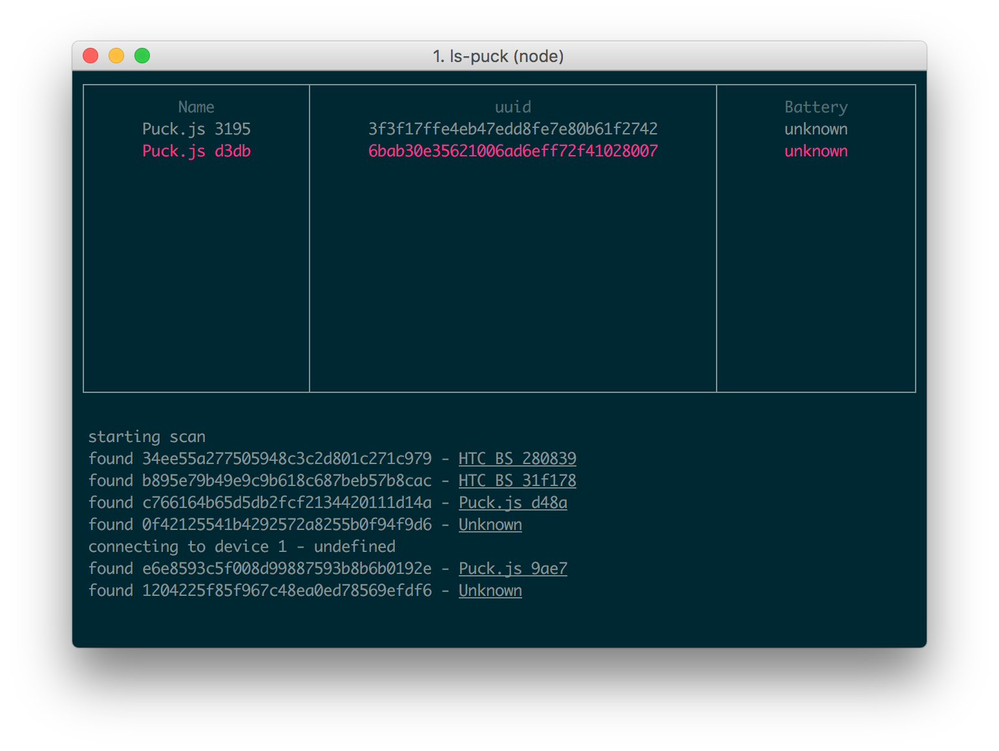

# ls-puck

A script to show which puck is which (I'm always forgetting)



```
npm install -g ls-puck


ls-puck
```

* Select a puck with `up`/`down`
* Press `enter` to highlight the puck with a flash of LED1 (red)


### todo

* implement battery levels
